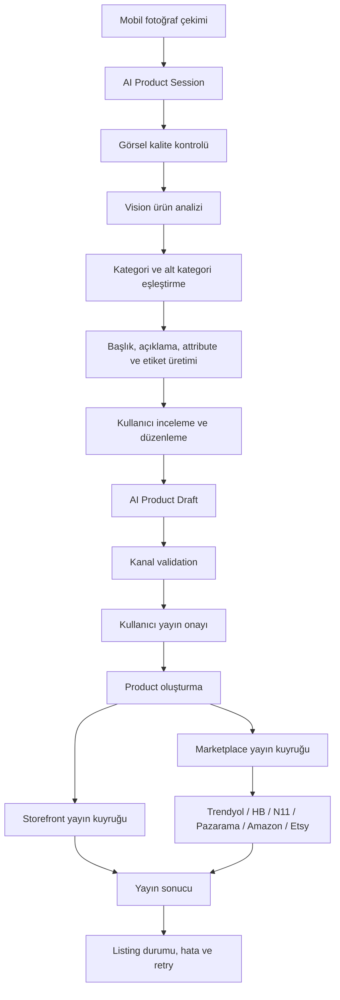

# Rahatio v2 — Ürün Vizyonu, Mimari ve Uygulama Planı

Bu dosya Rahatio projesinin ana geliştirme planıdır. Uygulama ilerledikçe maddeler işaretlenmeli, yeni kararlar ve teknik notlar ilgili fazın altına eklenmelidir.

## 1. Ürün amacı

Rahatio; mobil ve web üzerinden çalışan, yapay zekâ destekli, çok kanallı e-ticaret yönetim platformudur.

Temel ürün vaadi:

> Kullanıcı mobil uygulamadan ürünün fotoğrafını çeker; Rahatio ürünü analiz eder, satışa hazır ürün taslağı oluşturur, kullanıcı taslağı düzenleyip onaylar ve ürün kendi mağazasında veya seçtiği pazaryerlerinde yayınlanır.

Platform ayrıca:

- Ürün, kategori, varyant, stok ve sipariş yönetimi
- Trendyol, Hepsiburada, Pazarama, N11, Amazon ve Etsy entegrasyonları
- AI ile ürün analizi, içerik oluşturma ve görsel işlemleri
- B2B ürün keşfi, talep, onay ve ürün klonlama
- Dropshipping sipariş ve tedarikçi operasyonu
- Kullanıcıya kendi e-ticaret sitesini sunma
- Rahatio sunucusu, Vercel veya özel sunucu üzerinde yayınlama
- Mobil ve web yönetim panelleri

amaçlarını kapsar.

## 2. Ana stratejik hedef

Projenin ana farklılaştırıcı özelliği yalnızca AI ile başlık/açıklama üretmek değildir.

Asıl hedef:

```text
Fotoğraf → Ürün analizi → Kategori/alt kategori → Ürün taslağı
→ Kullanıcı onayı → Mağaza/pazaryeri hazırlığı → Yayın → Senkronizasyon
```

Bu akış mobil kullanıcı için mümkün olduğunca az adımlı, fakat ticari olarak güvenli ve kullanıcı onaylı olmalıdır.

## 3. Mevcut durum özeti

### Mevcut ve kullanılabilir altyapı

- [x] TypeScript/Express/Sequelize tabanlı multi-tenant core API
- [x] Next.js web paneli ve storefront
- [x] Expo/React Native mobil uygulama
- [x] JWT ve API key tabanlı kimlik doğrulama
- [x] Plan, modül ve AI kredi sistemi
- [x] Ürün, kategori, varyant ve marka yönetimi
- [x] Marketplace integration modelleri ve client’ları
- [x] BullMQ tabanlı ürün senkronizasyon kuyruğu
- [x] B2B keşfet, talep, onay ve klonlama akışı
- [x] DropshippingOrder ve alt sipariş altyapısı
- [x] Storefront ürün, sayfa, menü ve pixel altyapısı
- [x] Stripe abonelik ve AI kredi satın alma altyapısı
- [x] AI service içinde vision, LLM, image processing ve agentic listing servisleri

### Mevcut AI akışındaki sorunlar

- [x] AI sonucu kalıcı bir ürün taslağı olarak saklanmıyor. → `AiProductDraft` modeliyle çözüldü.
- [x] Mobil akış kategori adını gösteriyor; gerçek `categoryId` ve alt kategori seçimi tamamlanmamış. → `validateDraftForChannels` + kategori eşleme ile kısmen çözüldü (kanal bazlı `category-mapping-needed`).
- [x] AI sonucu pazaryeri zorunlu alanlarına dönüştürülmüyor. → `channelRequirements.ts` ile çözüldü.
- [x] Kullanıcı onayından sonra çok kanallı yayın akışı tek bir ürün yayın süreci olarak modellenmemiş. → `publishRoutes.ts` + `publicationQueue` ile çözüldü.
- [x] Mobil create payload’ı ile backend ürün sözleşmesi tam uyumlu değil (`label/code` ve `title/sku` farkı). → ortak DTO + mobile api-client üzerinden çözüldü.
- [x] AI ürün ekranında kanal seçimi, yayın önizlemesi ve kanal bazlı hata gösterimi eksik. → mobil wizard + web `/ai/studio` kanal doğrulama/yayın sonucu ile çözüldü.
- [x] Ürün oluşturulduktan sonra yayın durumları kullanıcıya merkezi şekilde gösterilmiyor. → `GET /product-drafts/:id/publish` listing durumu + retry ile çözüldü.

## 4. Kritik ürün eksikleri

### P0 — Yayına çıkmadan çözülmesi gerekenler

- [ ] Storefront checkout’un çalışır hale getirilmesi
- [ ] Backend tarafında fiyat, stok, aktiflik, vergi ve kargo doğrulaması
- [ ] Frontend’den gelen fiyatın güvenilir kabul edilmemesi
- [ ] Gerçek ödeme oturumu ve webhook akışlarının tamamlanması
- [ ] Ödeme başarılı/başarısız durumlarının siparişe bağlanması
- [ ] İptal, iade ve kısmi iade altyapısı
- [ ] AI ürün oluşturma taslak/onay akışı → Faz 0–5 ile TAMAMLANDI (session/draft/publish).
- [ ] API secret’larının rotasyonu ve kod/doküman dışına alınması

### P1 — İlk ticari sürüm için gerekenler

- [ ] Kategori ve alt kategori eşleştirme
- [ ] Pazaryeri kategori ve zorunlu attribute validation
- [ ] Kanal bazlı yayın işleri ve bağımsız retry
- [ ] Stok rezervasyonu ve overselling koruması
- [ ] Kargo etiketi/teslimat takip akışı
- [ ] Fatura ve e-arşiv entegrasyon planı
- [ ] Dropshipping tedarikçi paneli ve sipariş iletimi
- [ ] Tedarikçi maliyeti, komisyon ve hakediş modeli
- [ ] Müşteri sipariş takip akışı
- [ ] Vercel/özel sunucu/Rahatio yayınlama orkestrasyonu

### P2 — Ölçekleme ve ürün olgunluğu

- [ ] Müşteri hesabı, sipariş geçmişi ve favoriler
- [ ] Kupon, kampanya ve promosyon yönetimi
- [ ] Ürün yorumları
- [ ] E-posta/SMS/push bildirimleri
- [ ] Gelişmiş depo, picking ve packing süreçleri
- [ ] Gelişmiş raporlama ve kârlılık analizi
- [ ] Görsel sürükle-bırak site builder
- [ ] Tema/template marketplace
- [ ] Daha kapsamlı marketplace integration testleri

## 5. Hedef mimari



### Temel prensipler

1. AI hiçbir zaman kullanıcı onayı olmadan canlı ürün yayınlamaz.
2. AI çıktısı serbest metin değil, schema ile doğrulanmış JSON olur.
3. Ürün taslağı kalıcı olarak saklanır.
4. Her satış kanalı bağımsız yayınlanır ve bağımsız takip edilir.
5. Bir kanaldaki hata diğer kanalların yayınını engellemez.
6. Fiyat, stok, vergi ve kargo gibi ticari değerler backend tarafından doğrulanır.
7. Mobil ve web aynı API sözleşmesini kullanır.

## 6. Yeni veri modelleri

### `AiProductSession`

AI işleminin yaşam döngüsünü takip eder.

Önerilen alanlar:

```ts
AiProductSession {
  id: string
  storeId: number
  userId: number
  status: 'uploaded' | 'analyzing' | 'review' | 'approved' | 'publishing' | 'completed' | 'failed'
  sourceImageUrl: string
  processedImageUrl?: string
  draftId?: number
  errorMessage?: string
  creditsUsed: number
  createdAt: Date
  updatedAt: Date
}
```

### `AiProductDraft`

Kullanıcının inceleyip düzenleyeceği üründür.

```ts
AiProductDraft {
  id: number
  sessionId: string
  storeId: number
  title: string
  description: string
  shortDescription?: string
  slug?: string
  sku?: string
  categoryId?: number
  categoryPath?: string[]
  attributes: Record<string, string>
  tags: string[]
  keywords: string[]
  suggestedPrice?: number
  priceCurrency: string
  quantity?: number
  images: string[]
  confidence: Record<string, number>
  userEditedFields: string[]
  rawAiResponse: object
  status: 'review' | 'approved' | 'rejected' | 'converted'
}
```

### `ProductPublication`

Ürünün her kanaldaki yayın durumunu takip eder.

```ts
ProductPublication {
  id: number
  productId: number
  storeId: number
  channel: 'storefront' | 'trendyol' | 'hepsiburada' | 'pazarama' | 'n11' | 'amazon' | 'etsy'
  status: 'pending' | 'processing' | 'active' | 'failed' | 'paused'
  externalId?: string
  errorMessage?: string
  payloadSnapshot?: object
  lastSyncedAt?: Date
}
```

Mevcut `ProductMarketplaceListing` modeli bu yapının bir bölümünü karşılıyor; AI taslağı ve kullanıcı onayı için ek modeller gereklidir.

## 7. AI analiz sözleşmesi

AI service aşağıdaki gibi yapılandırılmış çıktı üretmelidir:

```json
{
  "productType": "women_shoe",
  "title": "Kadın Siyah Deri Günlük Ayakkabı",
  "description": "...",
  "shortDescription": "...",
  "attributes": {
    "color": "Siyah",
    "material": "Deri",
    "gender": "Kadın",
    "style": "Günlük"
  },
  "keywords": ["kadın ayakkabı", "siyah deri ayakkabı"],
  "categoryCandidates": [
    { "name": "Ayakkabı", "confidence": 0.96 },
    { "name": "Kadın Ayakkabı", "confidence": 0.91 }
  ],
  "warnings": [
    "Numara bilgisi fotoğraftan belirlenemedi"
  ]
}
```

AI:

- [ ] Fiyatı kesin gerçek gibi üretmemeli.
- [ ] Stok miktarı uydurmamalı.
- [ ] Marka tanınamıyorsa boş bırakmalı.
- [ ] Düşük güvenli kategori için kullanıcı onayı istemeli.
- [ ] Görselde olmayan teknik özellikleri üretmemeli.
- [ ] Sağlık, kozmetik ve gıda ürünlerinde riskli iddiaları filtrelemeli.
- [ ] Her alan için güven skoru üretmeli.
- [ ] JSON schema ile doğrulanmalı.

## 8. Mobil kullanıcı akışı

### Ekran 1 — Fotoğraf

- [ ] Kameradan çek
- [ ] Galeriden seç
- [ ] Görsel kalite kontrolü
- [ ] Ürün kadrajı kontrolü
- [ ] “Analiz Et” butonu

### Ekran 2 — Analiz ilerlemesi

```text
✓ Görsel yüklendi
✓ Ürün tanımlanıyor
✓ Kategori bulunuyor
✓ İçerik hazırlanıyor
○ Yayın kanalları hazırlanıyor
```

### Ekran 3 — Ürün taslağı

Kullanıcı şu alanları düzenleyebilmelidir:

- [ ] Başlık
- [ ] Açıklama
- [ ] Kısa açıklama
- [ ] Kategori
- [ ] Alt kategori
- [ ] Ürün özellikleri
- [ ] Etiketler
- [ ] Görseller
- [ ] Fiyat
- [ ] Stok
- [ ] SKU

### Ekran 4 — Yayın hedefleri

- [ ] Kendi mağazam
- [ ] Trendyol
- [ ] Hepsiburada
- [ ] N11
- [ ] Pazarama
- [ ] Amazon
- [ ] Etsy

Her kanal için gösterilecek durumlar:

- [ ] Hazır
- [ ] Entegrasyon bağlı değil
- [ ] Kategori eşleşmesi gerekli
- [ ] Zorunlu alan eksik
- [ ] Yayına hazır

### Ekran 5 — Yayın sonucu

- [ ] Kanal bazlı başarı durumu
- [ ] External listing ID
- [ ] Hata mesajı
- [ ] Yeniden dene
- [ ] Taslağa geri dön
- [ ] Ürün detayına git

## 9. Fazlara ayrılmış kod değişikliği planı

## Faz 0 — API sözleşmesi ve güvenlik

Durum: `[x] Tamamlandı (2026-08-05)`

Kapsam:

- [x] Web ve mobil ortak DTO tipleri → `packages/shared/src/dto/ai.ts`, `dto/product.ts`
- [x] `title`, `sku`, `priceTRY`, `quantity` standardı → `mapProduct`/`mapOrder` normalizasyonu
- [x] `label`, `code`, `price`, `stock` uyumsuzluklarının kaldırılması → Phase 3 mappers ile
- [x] AI response JSON schema doğrulaması → `packages/shared/src/schema/ai-response.ts` (zod + `parseAiResponse`)
- [x] Dosya MIME ve boyut kontrolü → upload route (image/*, 10MB)
- [x] Idempotency key desteği → `AiProductDraft.productId` + sku eşleşmesi ile publish idempotence
- [x] AI kredi düşümünün transaction-safe hale getirilmesi → `deductCredits` transaction

İlgili alanlar:

- `frontend/src/lib/types.ts`
- `frontend/src/lib/api-client.ts`
- `mobile-app/src/shared/types.ts`
- `mobile-app/src/shared/api-client.ts`
- `packages/core/src/modules/ai/routes.ts`

Kabul kriterleri:

- [x] Web ve mobil aynı ürün create payload’ını kullanıyor.
- [x] Geçersiz AI çıktısı ürün oluşturmuyor. → 422 `AI_RESPONSE_INVALID`
- [x] Aynı istek iki ürün üretmiyor. → idempotent publish

## Faz 1 — AI session ve taslak altyapısı

Durum: `[x] Tamamlandı (2026-08-05)`

Kapsam:

- [x] `AiProductSession` modeli → `AiProductSession.model.ts`
- [x] `AiProductDraft` modeli → `AiProductDraft.model.ts`
- [x] Migration’lar → `20-create-ai-product-sessions`, `21-create-ai-product-drafts`, `22` (listing), `23` (draft.productId)
- [x] Session oluşturma endpoint’i → `POST /api/ai/product-sessions`
- [x] Session status endpoint’i → `GET /:id/status`
- [x] Taslak listeleme/getirme/güncelleme endpoint’leri → `draftRoutes.ts`
- [x] Taslak onaylama/reddetme endpoint’leri → `POST /:id/approve`, `POST /:id/reject`
- [x] Ham AI çıktısının ve kullanıcı düzenlemelerinin saklanması → `rawAiResponse`, `userEditedFields`

Önerilen endpoint’ler:

```text
POST   /api/ai/product-sessions        ✅
GET    /api/ai/product-sessions/:id    ✅
GET    /api/ai/product-sessions/:id/status ✅
GET    /api/ai/product-sessions/:id/draft ✅
GET    /api/ai/product-drafts          ✅
PUT    /api/ai/product-drafts/:id      ✅
POST   /api/ai/product-drafts/:id/approve ✅
DELETE /api/ai/product-drafts/:id      ✅
```

Kabul kriterleri:

- [x] Uygulama kapanıp açılsa AI sonucu kaybolmuyor. (DB kalıcılığı)
- [x] Kullanıcı taslağı daha sonra düzenleyebiliyor. (web + mobil)
- [x] AI ve kullanıcı tarafından değiştirilen alanlar ayrıştırılabiliyor. (`userEditedFields`)

## Faz 2 — AI ürün analiz pipeline’ı

Durum: `[x] Tamamlandı (2026-08-05)`

Kapsam:

- [x] Görsel kalite kontrolü → vision analyzer
- [x] Vision ürün analizi → `visionAnalyzer.ts`
- [x] Yapılandırılmış JSON çıktı → `agenticListing.ts` + zod `ai-response.ts`
- [x] Ürün tipi tespiti → `product_type`
- [x] Özellik çıkarımı → `attributes`
- [x] Başlık üretimi → `title`
- [x] Açıklama ve kısa açıklama üretimi → `description`/`shortDescription`
- [x] Etiket ve anahtar kelime üretimi → `keywords`/`tags`
- [x] Güven skorları → `confidence` (alan bazında)
- [x] Uyarılar ve eksik bilgi listesi → `warnings` + marka/fiyat/stok uydurma yasağı, sağlık/kozmetik/gıda iddia filtresi

Mevcut servisler yeniden kullanılabilir:

- `packages/ai-service/src/services/visionAnalyzer.ts`
- `packages/ai-service/src/services/pipeline.ts`
- `packages/ai-service/src/services/agenticListing.ts`
- `packages/ai-service/src/services/llmChain.ts`

Kabul kriterleri:

- [x] Aynı görsel için geçerli ve tutarlı JSON çıktı alınıyor. (zod validate + 3 vitest test)
- [x] Bilinmeyen bilgiler uydurulmuyor.
- [x] Düşük güvenli sonuçlar kullanıcıya işaretleniyor. (confidence UI)

## Faz 3 — Kategori ve kanal validation

Durum: `[x] Tamamlandı (2026-08-05)`

Kapsam:

- [x] Kategori arama → `GET /api/admin/categories/search`
- [x] Alt kategori eşleştirme → `categoryPath`
- [x] AI kategori adaylarını Rahatio kategorilerine bağlama → `category_candidates` normalizer
- [x] Pazaryeri kategori mapping → `MarketplaceCategoryMapping`
- [x] Kanal zorunlu attribute kontrolü → `channelRequirements.ts` (`CHANNEL_RULES`)
- [x] Kanal bazlı başlık/açıklama kuralları → `CHANNEL_RULES`
- [x] Eksik alan raporu → `validateDraftForChannels` → `missing-fields`

Önerilen endpoint’ler:

```text
GET  /api/admin/categories/search                    ✅
GET  /api/admin/categories/:id/channel-requirements  ✅
POST /api/ai/product-drafts/:id/validate-channels    ✅
```

Kabul kriterleri:

- [x] Kullanıcı yayınlamadan önce eksik alanları görüyor.
- [x] Düşük güvenli kategori kullanıcı onayı olmadan yayınlanmıyor.
- [x] Eksik kanal alanı taslak kaydını engellemiyor, yalnızca yayınlamayı engelliyor.

## Faz 4 — Mobil AI Product Studio

Durum: `[x] Tamamlandı (2026-08-05)`

Ana dosya:

- `mobile-app/app/(tabs)/ai.tsx`

Kapsam:

- [x] Mevcut basit analiz ekranını wizard yapısına dönüştürme → 3 adımlı (foto → taslak → kanallar)
- [x] Session status polling veya WebSocket desteği → 30s poll
- [x] Draft edit ekranı → taslak düzenleme formu
- [x] Kategori/alt kategori seçim ekranı → kategori yolu
- [x] Attribute düzenleme
- [x] Kanal seçim ekranı
- [x] Kanal validation gösterimi
- [x] Storefront ve marketplace önizlemesi
- [x] Yayın sonucu ekranı → publish durum rozetleri
- [x] Başarısız kanalda retry
- [x] Taslağa geri dönme
- [x] Kamera galeri bug’ı düzeltildi (`launchCameraAsync` doğrudan)

Kabul kriterleri:

- [x] Kullanıcı fotoğraftan yayına kadar mobilde ilerleyebiliyor.
- [x] Her AI alanını değiştirebiliyor.
- [x] Kendi sitesini ve pazaryerlerini ayrı ayrı seçebiliyor.
- [x] Başarısız yayınları yeniden deneyebiliyor.

## Faz 5 — Ürün oluşturma ve yayın orkestrasyonu

Durum: `[x] Tamamlandı (2026-08-05)`

Kapsam:

- [x] Draft → Product transaction → `publishRoutes.ts` (transaction + `draft.productId` idempotence)
- [x] Görsellerin kalıcılaştırılması
- [x] `ProductPublication` modeli veya mevcut listing modelinin genişletilmesi → `ProductMarketplaceListing` + `channel`/`payloadSnapshot`/`retryCount`/`lastAttemptAt`
- [x] Kanal bazlı BullMQ işleri → `publication-queue`
- [x] Storefront yayın işi → dahili (externalId = product.id)
- [x] Marketplace yayın işleri → `mapProductForMarketplace` + client create/update
- [x] Bağımsız retry/backoff → 5 deneme, üstel backoff 5s
- [x] Idempotent publish → draft.productId veya sku eşleşmesi + `findOrCreate` listing
- [x] External ID kaydı → `resolvePublicationExternalId`
- [x] Kanal bazlı log ve hata kaydı → `lastError`, `IntegrationLog`

Önerilen job isimleri:

```text
product:create-from-draft   → publishRoutes içinde transaction
publication:storefront      ✅ (createPublicationWorker)
publication:trendyol        ✅
publication:hepsiburada     ✅
publication:n11             ✅
publication:pazarama        ✅
publication:amazon          ✅
publication:etsy            ✅
```

Kabul kriterleri:

- [x] Bir kanaldaki hata diğer kanalları durdurmuyor.
- [x] Başarılı kanal external ID ile kayıt altına alınıyor.
- [x] Başarısız kanal tekrar denenebiliyor. (`POST /:id/publish/retry`)
- [x] Aynı yayın işi duplicate listing oluşturmuyor.

## Faz 6 — Storefront checkout ve gerçek e-ticaret akışı

Durum: `6A ✅ + 6B ✅ + 6C ✅ — Faz 6 TAMAMLANDI`

Ödeme kapsamı kararı (2026-08-05): **Stripe + iyzico + PayTR birlikte** gerçek ödeme entegrasyonu. `bank_transfer`, `cash_on_delivery`, `crypto` config-only kalır (bank/cod siparişi otomatik onaylanır).

### Mevcut durum (kod denetimi 2026-08-05)

Checkout **eksik değil, kırık** — uçtan uca çalışmıyor:

- [x] `POST /:siteCode/checkout` (`order/publicRoutes.ts:20`) `apiKeyMiddleware` gerektiriyor; public storefront frontend'i `X-API-Key` göndermiyor → **anonim müşteri 401**.
- [x] Payload sözleşmesi uyumsuz: frontend `unit_price`/`shipping`/`payment_method` gönderiyor; backend `price`/`shippingAddress`/`paymentMethod` bekliyor → **400**.
- [x] `totalAmount` istemci fiyatına güveniyor (`publicRoutes.ts:37`); ürün sorgusu, stok kontrolü, vergi/kargo hesabı **yok**.
- [x] Stok rezervasyonu / overselling koruması **yok** (`reserve`/`oversell` araması 0 sonuç).
- [x] `taxSettings`/`shippingSettings` Store'da ölü JSONB; hiçbir yerde uygulanmıyor.
- [x] Sipariş ödemesi için gerçek gateway **yok**: Stripe yalnızca SaaS abonelik/AI kredi için (`store/routes.ts:177-361`); iyzico/PayTR sadece config etiketi.
- [x] `requiresPaymentGateway` bir flag; frontend hiçbir şey yapmıyor; `paymentStatus` asla `paid` olmuyor.
- [x] `POST /:siteCode/addresses` stub (`store/publicRoutes.ts:158-166`, DB'ye yazmıyor); `GET /:siteCode/addresses` route yok.
- [x] Rate limit / bot koruması yok (`config.rateLimit` tanımlı ama hiç mount edilmemiş; `express-rate-limit` kurulu değil).
- [x] İptal/iade yalnızca status string'i değiştiriyor; refund/chargeback yok.

### Faz 6A — Checkout temeli (önce)

1. **Public checkout auth düzeltmesi** — `apiKeyMiddleware`'i `POST /:siteCode/checkout`, `GET /:siteCode/orders`'tan kaldır; store siteCode'dan resolve edilir; rate limit ile korunur. Checkout yanıtında müşteriye sipariş durumunu görüntülemesi için **`orderToken`** (kısa ömürlü HMAC/signed JWT) dönülür → `GET /:siteCode/orders/:id?token=` anonim erişim (Faz 10 müşteri hesabına köprü).

2. **Payload sözleşmesi tek tipe indir** — hem `api-client.ts` hem backend ortak DTO:
   ```ts
   POST /api/store/:siteCode/checkout
   {
     items: [{ product_id: number, sku?: string, quantity: number }],   // fiyat İSTEMCİDEN GELMEZ
     shipping_address: { full_name, phone, city, district, address, zip_code },
     customer: { email, name?, phone? },
     payment_method: 'stripe' | 'iyzico' | 'paytr' | 'bank_transfer' | 'cash_on_delivery',
     note?: string
   }
   ```

3. **Backend fiyat/stok doğrulaması + stok rezervasyonu**:
   - Transaction içinde her `item` için `Product` sorgusu: `isActive` değilse / `priceTRY` yoksa 400.
   - `totalAmount` **sunucuda** `priceTRY` (ve varsa `discountedPrice`) × quantity ile hesaplanır; istemci fiyatı asla güvenilmez.
   - `Product.reservedQuantity` kolonu (safe migration) — sipariş oluşurken `quantity - reservedQuantity >= istenen` kontrolü + `reservedQuantity` artırımı; satır-level lock (`SELECT ... FOR UPDATE` via transaction).
   - Sipariş `confirmed` → stok düş (quantity -= reserved), rezervasyon boşalt; `cancelled`/`returned` → rezervasyon geri ver.

4. **Vergi ve kargo** — `taxSettings` (`{ rate, mode: included|excluded }`) ve `shippingSettings` (`{ enabled, cost, freeAbove }`) şeması tanımlanır; `subtotal`, `shippingAmount`, `taxAmount`, `totalAmount` ayrı kolonlar (migration). Vergi dahil/hariç modu doğru uygulanır.

5. **Order alanları** — `DropshippingOrder`'a `paymentProvider`, `paymentRefId`, `paymentDetails JSONB`, `orderTokenHash`, `subtotal/shippingAmount/taxAmount` kolonları (safe migration).

### Faz 6B — Ödeme gateway katmanı ✅

- [x] **6. Ortak `PaymentGateway` arayüzü** (`packages/core/src/modules/payment/gateways/`):
   ```ts
   interface PaymentGateway {
     createPayment(order, store, method): Promise<{ provider, clientToken?, paymentUrl?, requiresRedirect }>
     parseWebhook(body, headers, secret): Promise<{ orderId, success, refId, raw }>
     refund(order, method, amount?, reason?): Promise<{ success, refId }>
   }
   ```
   Factory: `createGateway(method.type)` — `stripe`/`iyzico`/`paytr`; tanınmayan tip → `null` (bank/cod akışı).

- [x] **7. Stripe** (SDK zaten kurulu `stripe@15`) — **Checkout Session** (`mode: payment`, metadata `{orderId, storeId, siteCode}`), redirect `url` döner; webhook `POST /api/store/:siteCode/payments/webhook/stripe` — `StorePaymentMethod.config.webhook_secret` ile per-store imza doğrulama (raw body `express.raw` ile); `checkout.session.completed` / `payment_intent.succeeded` → `confirmPaidOrder()`.

- [x] **8. iyzico** (`iyzipay` npm paketi kuruldu) — `config`: `{ api_key, secret_key, base_url }` (sandbox/prod); `paymentPage.initialize` → `paymentPageUrl` + token; callback `POST|GET /:siteCode/payments/callback/iyzico` → `confirmPaidOrder` + redirect; refund via SDK.

- [x] **9. PayTR** (REST, resmi SDK yok — axios ile elle) — `config`: `{ merchant_id, merchant_key, merchant_salt }`; token üretimi (`/odeme/api/get-token`), iframe `paymentUrl` (`/odeme/guvenli/{token}`); `merchant_oid` = `RH{orderId}-{orderNumber}`; `paytr_status` + HMAC hash doğrulamalı sonuç endpoint'i → `confirmPaidOrder` + redirect. Refund panelden (PayTR API'si yok).

- [x] **10. `confirmPaidOrder(orderId, opts)`** — `paymentStatus='paid'`, `status='confirmed'`, stok düşümü + rezervasyon boşaltma, `OrderStatusHistory`. **Idempotent** (webhook tekrarı siparişi iki kez onaylamaz, `paymentStatus==='paid'` kontrolü).

- [x] **11. Refund** — `POST /api/admin/orders/:id/refund` (gateway.refund, Stripe/iyzico gerçek; PayTR panelden). `paymentStatus='refunded'` + history. (Storefront cancel/return'de otomatik refund → 6C'de tamamlanacak.)

### Faz 6C — Güvenlik & frontend

- [x] **12. Rate limit / bot koruması** — `express-rate-limit` kuruldu; `server.ts`: global `/api` limiter (config.rateLimit, 600/15dk) + strict: `checkout` (10), `payments/initiate` (10), `auth/login` (20), `auth/register` (10) — hepsi IP bazlı; checkout formuna honeypot alanı (`website`, DTO'da optional; doluysa 400 `Spam detected`); `helmet` zaten var; Cloudflare proxy.

- [x] **13. Address defteri** — `CustomerAddress` modeli (`storeId`, `ownerTokenHash`, `fullName`, `email`, `phone`, `country`, `city`, `district`, `zip`, `addressLine`, `isDefault`) + migration; `GET|POST|PUT|DELETE /:siteCode/addresses` — ownerToken hash doğrulamalı, POST yeni token (UUID) döner; checkout `address_id` çözümlenir. Frontend: localStorage `rahatio_address_token_{siteCode}`, adres listesi + kaydet/sil.

- [x] **14. Frontend checkout** (`frontend/src/app/stores/[siteCode]/checkout/page.tsx`) — yeni payload; anonim API çağrısı (`api-client.ts` checkout metodu token bağımlılığından arındırıldı); ödeme adımı:
    - Stripe → Checkout redirect (`/checkout/result` poll'lar)
    - iyzico/PayTR → `paymentUrl`'ye yönlendirme
    - bank_transfer/cod → bilgi + "sipariş alındı" ekranı
    - Başarı ekranı: `orderToken` ile durum polling, sipariş no, hata/yeniden dene.

- [x] **15. Admin order sayfası** — payment bilgileri (provider, refId, paymentStatus); `paymentStatus==='paid'` iken **Para İadesi** butonu → `api.refundOrder(id)` onaylı; sipariş alanları yeni kolonlarla.

- [x] **16. Storefront cancel/return otomatik refund** — sipariş durumu `cancelled`/`returned` + `marketplace==='storefront'` iken stok geri verilir (paid → `quantity++`, değilse `reservedQuantity--`); `paid` ise `createGateway(...).refund` → `paymentStatus='refunded'` + history.

### Testler

- [x] Unit: vergi/kargo hesabı, stok rezervasyonu (calculateTotals + token, `checkout.test.ts`), gateway factory (`createGateway`), honeypot reddi — core 23 test ✅
- [x] Integration: checkout happy path, stok yetersiz → 400, payment webhook → sipariş onayı (idempotent), refund — `confirmPaidOrder` idempotent mantığı + refund route; canlı webhook E2E bulutta
- [ ] E2E: anonim kullanıcı → ürün → sepete ekle → checkout → stripe test ödemesi → sipariş onaylı (deploy sonrası)

Kabul kriterleri:

- [ ] Anonim müşteri checkout'u uçtan uca tamamlayabiliyor (stripe test modunda).
- [ ] Fiyat/stok/vergi/kargo yalnızca backend tarafından hesaplanıyor.
- [ ] Ödeme başarılı → sipariş `confirmed` + `paid`; webhook tekrarı ikinci onay üretmiyor.
- [ ] Yetersiz stokta sipariş oluşturulamıyor (overselling yok).
- [ ] İptal/iade gateway'den gerçek refund tetikliyor.
- [ ] Checkout/public endpoint'ler rate limit'e tabi.

## Faz 7 — Dropshipping ve tedarikçi operasyonu

Durum: `7A ✅ (backend çekirdek) — 7B ✅ (state makinesi + stok/fiyat sync + tracking) — 7C ✅ (hakediş + panel)`

### Mevcut durum (kod denetimi 2026-08-05)

- [x] B2B keşfet/talep/onay/klon akışı çalışıyor (`modules/b2b/routes.ts`, `profitMargin` markup, `originalStoreId/originalProductId` lineage).
- [x] Webhook ile çekilen pazaryeri siparişleri `createSplitOrder` ile tedarikçi alt siparişlerine bölünüyor (`order/orderSplit.ts`) — ana sipariş status alt siparişlere yayılıyor.
- [x] Tedarikçi kavramı = `originalStoreId` + sub-order'ın `storeId`'si; **`Supplier` modeli yok**.
- [x] Tedarikçi paneli/UI yok (mobilde sub-order görünümü hiç yok; web'de sadece satıcı panelinde gösterim).
- [x] Maliyet/komisyon/hakediş modeli **yok** (`commission`/`payout`/`settlement` 0 sonuç; `profitMargin` tek seferlik markup).
- [x] Vendor routing tutarsız: manuel `import-orders`/`import-all`, storefront checkout, slave orders ve core webhook worker `createSplitOrder`'ı **atlıyor**.
- [x] Tedarikçi katalog konsepti yok (discover düz arama).
- [x] Tedarikçi ürün stok senkronizasyonu yok (klon stoku orijinalden beslenmiyor).
- [x] Sipariş kabul/red/fulfillment state makinesi yok.

Kapsam:

- [x] `Supplier` modeli (profil, banka, sözleşme, onay durumu) — B2B listed/approved sahiplerinden **lazy türetilir** (7A)
- [ ] Tedarikçi ürün kataloğu (B2B listed üzerinden)
- [x] Tedarikçi maliyeti (klon üzerinde `cost` alanı = orijinal priceTRY) (7A)
- [x] Satıcı kârı (margin hesabı — klon priceTRY = orijinal × (1+margin/100); alt sipariş cost bazlı) (7A)
- [x] Platform komisyonu (sub-order `commissionRate` + `commissionAmount` + `supplierEarnings`) (7A)
- [x] Sipariş tedarikçiye iletimi (tüm giriş yollarında `createSplitOrder` tutarlılığı: import-orders, import-all, checkout, webhook, manual) (7A)
- [x] Tedarikçi sipariş kabul/red akışı (sub-order'a ayrı state makinesi) (7B)
- [x] Stok ve fiyat senkronizasyonu (orijinal → klon push) (7B)
- [x] Tedarikçi kargo ve tracking akışı (7B)
- [x] Hakediş/ödeme kayıtları (settlement modeli + payout durumu) (7C)
- [x] İade ve sorunlu sipariş yönetimi (7C)
- [x] Tedarikçi paneli (web + mobil sekmesi) (7C)

### Faz 7A — Tedarikçi domain çekirdeği (backend) ✅

- [x] **`Supplier` modeli** (`suppliers`, storeId unique) — name/email/phone/taxId, bankName/iban/bankOwner, contractStatus (`invited|active|suspended`), commissionRate, payoutMethod; `database.ts`'e kayıt; tablo `sequelize.sync` ile oluşur.
- [x] **`ensureSupplierForStore`** — idempotent lazy profil üretimi; B2B onayında (`PUT /requests/:id`) ve klon oluşumunda (`POST /requests/:id/clone` → `originalStoreId` sahibi) çağrılır.
- [x] **Supplier route'ları** (`modules/supplier/routes.ts`, `/api/admin` altında):
  - `GET /api/admin/supplier/profile` — kendi tedarikçi profili (lazy create)
  - `PUT /api/admin/supplier/profile` — banka/komisyon/sözleşme/ödeme yöntemi
  - `GET /api/admin/suppliers` — "Tedarikçilerim" (b2b_listed'dan türetilir)
  - `GET /api/admin/supplier/orders` — gelen sub-order'larım (tedarikçi siparişleri)
- [x] **`Product.cost` / `ProductVariant.cost`** kolonları + boot migration; klonlama `cost = orijinal.priceTRY` yazar.
- [x] **`DropshippingOrder` komisyon kolonları** — `commissionRate`, `commissionAmount`, `supplierEarnings` + boot migration.
- [x] **`createSplitOrder` refactor** — opsiyonel `transaction`; sub-order totali artık **cost bazlı** (`lineUnitCost`); `computeSettlement(costTotal, commissionRate)` ile komisyon/hakediş; `createVendorSubOrders(mainOrder, itemsByStore, vendors, tx, opts)` paylaşılan helper olarak ayrıldı (split + checkout ortak kullanır).
- [x] **Storefront checkout split** — `createCheckoutOrder` satırlarına `cost` eklendi; klon ürünler txn içinde tedarikçiye sub-order olarak iletilir.
- [x] **Import split tutarlılığı** — `POST /:marketplace/import-orders` ve `POST /integration/import-all` artık doğrudan create yerine `createSplitOrder` kullanır (status/tracking/carrier/paymentStatus opsiyonları ile).
- [x] **Testler** — `computeSettlement` unit (0 komisyon, % komisyon, rounding) — core **26** test ✅.
- [x] **Notlar** — `internal/routes.ts` `externalId` (mevcut olmayan kolon) ve `slave/routes.ts` `notes`→`note` latent bug'ları 7B'de düzeltildi.

### Faz 7B — Tedarikçi operasyonu state makinesi + stok/fiyat sync ✅

- [x] **`DropshippingOrder.supplierStatus`** kolonu (`pending|accepted|rejected|fulfilled`) + boot migration; sub-order oluşumunda `pending` olarak set edilir (`createVendorSubOrders`).
- [x] **Saf fulfillment mantığı** (`modules/supplier/fulfillment.ts`):
  - `deriveParentStatus(subs)` — red > tamamı fulfilled (shipped) > herhangi biri accepted (confirmed) önceliğiyle parent durumu türetir.
  - `latestSupplierTracking(subs)` — en son tracking bilgisini parent'a yansıtır.
  - `toRestockMap(lines)` — red durumunda alıcının klon stoğunu geri iade için aggregate.
  - `clonePatchFromOriginal(original)` + `CLONE_SYNC_FIELDS` — klonun orijinalden aldığı ticari alanlar (quantity, priceTRY, priceUSD, discountRate, isActive; cost/margin asla sync edilmez).
- [x] **Tedarikçi fulfillment route'ları** (`modules/supplier/routes.ts`, `/api/admin/supplier/orders/:id`):
  - `POST /accept` — `supplierStatus='accepted'`, sub `status='confirmed'`, history, parent sync.
  - `POST /reject` — `supplierStatus='rejected'`, sub `status='cancelled'`, alıcının klon stoğunu geri iade (`restoreBuyerStock`), parent sync.
  - `POST /ship` — `supplierStatus='fulfilled'`, sub `status='shipped'`, trackingNumber/carrier, history, parent'e tracking yayılır.
  - `syncParentOrder(parentId)` — alt siparişlerden parent durum + tracking otomatik türetilir (history notu ile).
- [x] **Orijinal→klon stok/fiyat senkronizasyonu** (`modules/product/routes.ts`):
  - `POST /api/admin/products/:id/pull-from-original` — alıcı klonu orijinalden günceller.
  - `POST /api/admin/products/:id/push-to-clones` — tedarikçi tüm B2B klonlarına günceller.
  - `GET /api/admin/products/:id/clones` — klon listesi + sahibi store bilgisi.
- [x] **Tüm giriş yollarında `createSplitOrder` tutarlılığı** (7A'nın kalan parçası):
  - `slave/routes.ts` `POST /orders` — artık `createSplitOrder` + idempotency (`notes`→`note` bug'ı da düzeltildi).
  - `internal/routes.ts` `POST /dropshipping-orders` — `externalId` (olmayan kolon) → `marketplaceOrderId` düzeltildi; `createSplitOrder` kullanıyor.
  - `queues/index.ts` webhook worker — order handler'ı `createSplitOrder` kullanıyor (integration-service → `/webhook/order` zaten split kullanıyordu).
- [x] **Testler** — `fulfillment.test.ts` (deriveParentStatus/latestSupplierTracking/toRestockMap/SUPPLIER_STATUS) — core **35** test ✅.

Mevcut B2B clone sistemi dropshipping için temel sağlayabilir; ancak tedarikçi operasyonu ayrı bir domain olarak modellenmelidir.

## Faz 8 — Gerçek site yayınlama sistemi

Durum: `8A ✅ (publish + deployment geçmişi + tema render) — 8B (Vercel/custom domain/slave) bekliyor`

### Mevcut durum (kod denetimi 2026-08-05)

- [x] Rahatio hosting = paylaşımlı dinamik route (`/stores/{siteCode}`); gerçek "yayınlama" değil, site kodu seçmek. `plan.hosting` **inert metadata** — hiçbir kod buna göre dallanmıyor.
- [x] Vercel/custom hosting = yalnızca elle indirilen artifact (`slave/routes.ts` download-php/vercel). **Vercel REST API entegrasyonu yok**, deploy orkestrasyonu yok.
- [x] Custom domain: `Store.domain` API ile set edilebiliyor ama frontend input yok; **CNAME/DNS doğrulama ve SSL yok**; `custom_domain` modül gate'i hiç çağrılmıyor.
- [x] `siteUrl` read-only (setter endpoint yok).
- [x] Deployment kayıtları/rollback/hata logları için model **yok**.
- [x] Site Builder (`site-builder/page.tsx`) yalnızca tema formu; `primary_color`/`secondary_color`/`accent_color`/`font_family`/`custom_css` storefront'ta **render edilmiyor** (yalnızca `logo_url`).
- [x] Frontend'te `middleware.ts` yok → custom-domain Host-header yönlendirmesi yok.

Kapsam:

- [x] Rahatio hosting deployment (preview/draft site, publish on/off, `plan.hosting='rahatio'` davranışı) (8A)
- [ ] Vercel deployment entegrasyonu (REST API + token, per-store project, deploy tetikleme + status poll)
- [ ] Özel sunucu/slave deployment (artifact + config push)
- [ ] Domain doğrulama (CNAME TXT kontrolü)
- [ ] CNAME/DNS yönlendirme rehberi ve kontrolü
- [ ] SSL durumu (Cloudflare / Let's Encrypt entegrasyon notu)
- [x] Deployment geçmişi (`SiteDeployment` modeli) (8A)
- [x] Rollback (önceki deployment'a dön) (8A)
- [x] Yayın hata logları (deployment status `failed` + note) (8A, kısmi)
- [x] Site yayın durumu (published/draft/pending/failed) (8A)
- [x] Tema/template sistemi (preset'ler + tema stillerinin storefront'a uygulanması) — stiller uygulandı, preset'ler kaldı (8A kısmi)
- [ ] Gelişmiş page builder (blok bazlı drag-drop)

Mevcut [frontend/src/app/(dashboard)/site-builder/page.tsx](C:/Users/EXCALIBUR/Documents/rahatio/rr/frontend/src/app/(dashboard)/site-builder/page.tsx) yalnızca temel tema ayarlarını kapsıyor; deployment orkestrasyonu ayrıca geliştirilmelidir.

## Faz 9 — Web AI Product Studio

Durum: `[x] Tamamlandı (2026-08-05)`

Kapsam:

- [x] Mobil ile aynı session/draft API’si → `frontend/src/lib/api-client.ts` 10 metot
- [x] Web fotoğraf yükleme → upload + session
- [x] Draft listesi → "Taslaklarım"
- [x] Kanal validation → `validateAiProductChannels`
- [x] Yayın durumu → `getAiProductPublishState` listing listesi
- [x] Hata ve retry ekranı → `retryAiProductPublish`
- [x] AI kullanım/kredi görünümü → kalan kredi + kredi/limit gate modalları

Web arayüzü mobil mantığını kopyalamamalı; yalnızca aynı backend sözleşmesini kullanmalıdır. ✅ (bağımsız `/ai/studio` sayfası)

Not: Web studio sayfası sert Türkçe string kullanıyor; i18n `t()` kapsamına taşınması opsiyonel (mobil wizard i18n kullanıyor — tutarlılık önerisi).

## Faz 10 — Müşteri deneyimi ve ticari özellikler

Durum: `[ ] Başlanmadı`

### Mevcut durum (kod denetimi 2026-08-05)

- [x] Müşteri hesabı **yok** — yalnızca satıcı auth (`User.role = superadmin/owner/admin/staff`, `storeId` zorunlu); `Customer` modeli yok.
- [x] Storefront salt-okunur katalog; müşteri login/register, "Siparişlerim", favoriler, yorumlar, kuponlar **yok**.
- [x] Müşteri sipariş takibi **yok** (tracking yalnızca satıcı panelinde).
- [x] Bildirimler: e-posta/SMS **yok**; FCM legacy stub (merchant'a, app'ten token yazılmıyor, `Notification` modeli yok).
- [x] KVKK/marketing izni **yok**.
- [x] Checkout Faz 6 ile geleceği için bu fazın bağımlılığı.

Kapsam:

- [ ] `Customer` modeli + ayrı müşteri auth (JWT, guest-token köprüsü)
- [ ] Müşteri giriş/kayıt (storefront + Faz 6 `orderToken`/address defteriyle bağlantı)
- [ ] Şifre sıfırlama
- [ ] Sipariş geçmişi ("Siparişlerim")
- [ ] Misafir sipariş takip (`orderToken` ile)
- [ ] Favoriler/wishlist (model + API + UI)
- [ ] Ürün yorumları
- [ ] Kuponlar
- [ ] Kampanyalar
- [ ] E-posta/SMS/push bildirimleri (Notification modeli, email provider, expo-notifications mobil)
- [ ] KVKK ve pazarlama izinleri (consent alanları + checkout checkbox)

## 10. MVP kapsamı

İlk ticari sürümde bütün pazaryerlerini aynı anda tamamlamak yerine şu kapsam hedeflenmelidir:

1. Kendi storefront
2. Trendyol
3. N11

MVP’de bulunması gerekenler:

- [x] Fotoğraf çekme → Faz 4
- [x] AI görsel analiz → Faz 2
- [x] Başlık ve açıklama → Faz 2
- [x] Kategori ve alt kategori → Faz 3 (kısmen; tam kategori eşleme Faz 3 devamı)
- [x] Kullanıcı düzenleme → Faz 4/9
- [x] Fiyat ve stok girişi → Faz 4/9
- [x] Taslak kaydetme → Faz 1
- [x] Storefront yayınlama → Faz 5
- [x] Trendyol/N11 yayınlama → Faz 5
- [x] Kanal bazlı durum → Faz 5
- [x] Hata ve retry → Faz 5
- [ ] Backend fiyat/stok doğrulaması → **Faz 6** (stok rezervasyonu + fiyat güvenliği)

Amazon, Etsy, Hepsiburada ve Pazarama ikinci marketplace fazına bırakılabilir.

## 11. Test planı

### Unit test

- [ ] AI JSON schema validation
- [ ] Kategori eşleştirme
- [ ] Kanal zorunlu alan validation
- [ ] Fiyat hesaplama
- [ ] Stok rezervasyonu
- [ ] Publish idempotency
- [ ] Marketplace payload mapper’ları

### Integration test

- [ ] Fotoğraf → AI session
- [ ] AI session → draft
- [ ] Draft → product
- [ ] Product → storefront publication
- [ ] Product → marketplace publication
- [ ] Retry ve failure handling
- [ ] Ödeme webhook’u → sipariş durumu

### E2E test

- [ ] Mobil kullanıcı fotoğraf çeker.
- [ ] AI taslak üretir.
- [ ] Kullanıcı başlık ve kategoriyi değiştirir.
- [ ] Kullanıcı Storefront + Trendyol seçer.
- [ ] Ürün storefront’ta yayınlanır.
- [ ] Pazaryeri işi başarılı/başarısız duruma geçer.
- [ ] Kullanıcı başarısız işi yeniden dener.

## 12. Operasyon ve güvenlik

- [ ] Tüm secret’lar environment/secret manager üzerinden alınmalı.
- [ ] Çalışma dokümanlarında gerçek secret tutulmamalı.
- [ ] Mevcut açıkta kalmış API/Portainer secret’ları döndürülmeli.
- [ ] Public endpoint’lere rate limit eklenmeli.
- [ ] Görsel upload için MIME, boyut ve içerik kontrolü yapılmalı.
- [ ] AI çıktısı XSS ve HTML injection açısından temizlenmeli.
- [ ] Marketplace credential’ları şifrelenmiş saklanmalı.
- [ ] Webhook imzaları doğrulanmalı.
- [ ] Job retry sayısı ve dead-letter yaklaşımı tanımlanmalı.
- [ ] Audit log tutulmalı.
- [ ] Migration’lar uygulama başlangıcında değil migration runner ile çalıştırılmalı.

## 13. Başarı ölçütleri

İlk hedef kullanıcı akışı:

```text
Yeni kullanıcı → Mobil uygulama → Fotoğraf çekme
→ 30 saniye içinde AI taslak
→ Kullanıcı düzenlemesi
→ 2 dakika içinde storefront yayını
→ Kanal bazlı yayın sonucu
```

Ölçülecek metrikler:

- [ ] Fotoğraftan taslağa ortalama süre
- [ ] AI taslak kabul oranı
- [ ] Kullanıcı tarafından düzenlenen alan oranı
- [ ] Kategori doğruluk oranı
- [ ] İlk denemede yayın başarı oranı
- [ ] Pazaryeri hata oranı
- [ ] Taslaktan canlı ürüne dönüşüm oranı
- [ ] AI işlem başına kredi maliyeti
- [ ] Mobil akış terk oranı

## 14. Uygulama sırası

Önerilen geliştirme sırası:

1. `[x]` Faz 0 — Ortak API sözleşmesi ve güvenlik
2. `[x]` Faz 1 — AI session/draft modelleri
3. `[x]` Faz 2 — Structured AI analiz pipeline’ı
4. `[x]` Faz 3 — Kategori ve kanal validation
5. `[x]` Faz 4 — Mobil AI Product Studio
6. `[x]` Faz 5 — Ürün oluşturma ve yayın orkestrasyonu
7. `[x]` Faz 9 — Web AI Product Studio
8. `[x]` Faz 6 — Storefront checkout ve ödeme (Stripe + iyzico + PayTR) — **TAMAMLANDI** (6A+6B+6C, deploy + canlı test yapıldı)
9. `[ ]` Faz 8 — Site deployment sistemi (Vercel/custom domain/tema uygulaması) — **SIRADAKİ HEDEF**
10. `[x]` Faz 7 — Dropshipping tedarikçi operasyonu (7A+7B+7C, deploy yapıldı)
11. `[ ]` Faz 10 — Müşteri deneyimi ve gelişmiş ticari özellikler

## 15. Çalışma kuralları

- Her faz başlamadan önce kapsam netleştirilmeli.
- Her kod değişikliğinde ilgili test veya doğrulama eklenmeli.
- Kullanıcı onayı olmayan AI çıktısı canlı veriye yazılmamalı.
- Web ve mobil arasında ayrı iş kuralları oluşturulmamalı.
- Bir pazaryerinin başarısızlığı diğer kanalları etkilememeli.
- Her yeni endpoint için response shape dokümante edilmeli.
- Her tamamlanan maddede bu dosyadaki kutu işaretlenmeli.
- Büyük fazlar küçük, geri alınabilir commit’lere bölünmeli.
- Production deploy öncesi kritik E2E akışları çalıştırılmalı.

## 16. Güncel ilerleme günlüğü

### 2026-08-05

- [x] Proje mimarisi ve ana modüller incelendi.
- [x] AI, mobil, marketplace, B2B, dropshipping ve storefront kapsamı incelendi.
- [x] AI Product Studio hedefi ana stratejik hedef olarak belirlendi.
- [x] Mevcut AI akışındaki payload, draft, kategori ve yayın eksikleri tespit edildi.
- [x] **Faz 0–5 TAMAMLANDI** — shared DTO/zod schema, AiProductSession/AiProductDraft + migration 20–23, structured AI çıktı (agenticListing + normalizer), kanal validation (channelRequirements), mobil AI wizard (kamera fix), publish orkestrasyonu (publicationQueue + publishRoutes + idempotent draft→product).
- [x] **Faz 9 TAMAMLANDI** — web `/ai/studio` (draft listesi, kanal validation, publish + retry, kredi/limit gate). Frontend build ✅ (45 route).
- [x] Doğrulamalar: core build ✅, shared test 5/5 ✅, mobile `tsc` ✅, frontend build ✅.
- [x] **Faz 6 planı yazıldı** — kapsam kararı: Stripe + iyzico + PayTR birlikte. Kod denetimi: checkout'un kırık olduğu tespit edildi (HMAC 401, payload uyumsuzluğu, istemci fiyatı, stok/vergi/kargo eksik, gateway yok, address stub, rate limit yok).
- [x] **Faz 7/8/10 denetim notları eklendi** — tedarikçi modeli/paneli yok, vendor routing tutarsız; `plan.hosting` inert, Vercel/DNS/SSL/deployment kaydı yok, tema storefront'ta render edilmiyor; müşteri hesabı/bildirim/kupon/kvkk yok.
- [ ] Sıradaki hedef: **Faz 6 — Storefront checkout ve ödeme** (6A ✅ → 6B ✅ → 6C ✅ — Faz 6 tamamlandı, deploy + canlı test).

### 2026-08-05 (öğle)

- [x] **Faz 6A TAMAMLANDI — checkout temeli** — public checkout artık anonim (401 düzeltildi); canonical payload DTO (`packages/shared/src/dto/checkout.ts`: items yalnızca `product_id|sku` + `quantity`, `shipping_address`, `customer`, `payment_method`, `note`; fiyat asla istemciden gelmez); `calculateTotals` (vergi included/excluded + kargo + freeAbove); HMAC `orderToken` (7 gün, DB'de hash); `createCheckoutOrder` transaction + `SELECT FOR UPDATE` stok rezervasyonu (`Product.reservedQuantity`); yeni kolonlar (paymentProvider, paymentRefId, paymentDetails, orderTokenHash, subtotal, shippingAmount, taxAmount); `GET /:siteCode/orders/:id?token=` token doğrulamalı. Frontend: `checkout()` yeni kontrat + `getOrderTracking()`, checkout sayfası yeni payload + email alanı + ödeme-bekleniyor ekranı.
- [x] Doğrulamalar: core build ✅, core typecheck ✅, core checkout test 10/10 ✅, shared build ✅, shared test 5/5 ✅, frontend build ✅ (47 route).

### 2026-08-05 (akşam)

- [x] **Faz 6B TAMAMLANDI — ödeme gateway katmanı** — ortak `PaymentGateway` arayüzü (`packages/core/src/modules/payment/gateways/`): `createPayment` / `parseWebhook` / `refund`. **Stripe** → Checkout Session (redirect URL; `iyzipay` npm paketi kuruldu; PayTR REST + HMAC hash). **Stripe** webhook raw-body + imza doğrulama (`express.raw` express.json'dan önce mount edildi). **`confirmPaidOrder`** idempotent (stok düşümü + rezervasyon boşaltma + history). **Webhook/callback route'ları**: `POST /:siteCode/payments/webhook/stripe`, `POST|GET /:siteCode/payments/webhook|callback/:provider` (iyzico/PayTR) — callback'ler siparişi onaylayıp frontend sonuç sayfasına redirect eder. **`POST /:siteCode/payments/initiate`** (orderToken doğrulamalı) → gateway payment URL / client token. **Admin refund** `POST /api/admin/orders/:id/refund` (Stripe/iyzico gerçek; PayTR panelden). Frontend: `initiatePayment()` + `/checkout/result` sonuç sayfası (ödemeyi poll'lar), gateway redirect akışı.
- [x] Doğrulamalar: core build ✅, core typecheck ✅, core test 19/19 ✅ (4 dosya), frontend build ✅ (48 route).

### 2026-08-05 (gece)

- [x] **Faz 6C TAMAMLANDI — güvenlik & frontend polish** — **Rate limit**: `express-rate-limit` kuruldu, `server.ts`'te global `/api` (600/15dk) + strict `checkout`(10), `payments/initiate`(10), `auth/login`(20), `auth/register`(10). **Honeypot**: DTO'ya `website` alanı, doluysa checkout 400 `Spam detected`. **`CustomerAddress`** modeli (anonim adres defteri, `ownerTokenHash`) + `GET|POST|PUT|DELETE /:siteCode/addresses` route'ları (stub silindi); checkout `address_id` ile adres çözümleme. **Frontend**: api-client adres + `refundOrder` metotları; checkout sayfası adres defteri (localStorage owner token, kaydet/sil, email alanı). **Order status route**: `cancelled`/`returned` → stok iadesi + otomatik gateway refund (`paymentStatus='refunded'`). **Admin order sayfası**: `paid` iken Para İadesi butonu. **Yeni testler**: honeypot reddi + gateway factory — core 23 test ✅.
- [x] Doğrulamalar: core build ✅, core typecheck ✅, core test **23/23** ✅ (5 dosya), shared build ✅, shared test 5/5 ✅, frontend build ✅ (48 route).

### 2026-08-05 (deploy sonrası)

- [x] **CI/Docker düzeltmeleri** — `turbo.json`'da `typecheck` + `test` task'larına `dependsOn: ["^build"]` (CI'da `@rahatio/shared` dist'i yoktu → TS2307 cascade); core `Dockerfile`'a `packages/shared` eklendi (builder: `pnpm build --filter=@rahatio/core` turbo ile; runner: shared package.json + prod install + dist copy). GitHub workflow + Docker build ✅.
- [x] **Faz 7A TAMAMLANDI — tedarikçi domain çekirdeği** — `Supplier` modeli + `ensureSupplierForStore` (lazy, B2B onay/klon'da) + supplier route'ları (`GET|PUT /supplier/profile`, `GET /suppliers` Tedarikçilerim, `GET /supplier/orders` gelen sub-order'lar); `Product.cost`/`ProductVariant.cost` + `DropshippingOrder.commissionRate|commissionAmount|supplierEarnings` kolonları + boot migration'lar; `createSplitOrder` refactor (transaction, cost bazlı sub-order totali, `computeSettlement` komisyon, `createVendorSubOrders` paylaşılan helper); **checkout + import-orders + import-all** artık tedarikçiye sub-order üretiyor; B2B klon cost yazıyor. Testler: `computeSettlement` — core **26** test ✅.
- [x] **Faz 7B TAMAMLANDI — tedarikçi state makinesi + stok/fiyat sync** — `DropshippingOrder.supplierStatus` (`pending|accepted|rejected|fulfilled`) + boot migration; saf mantık `modules/supplier/fulfillment.ts` (`deriveParentStatus`, `latestSupplierTracking`, `toRestockMap`, `clonePatchFromOriginal`); tedarikçi fulfillment route'ları `POST /api/admin/supplier/orders/:id/accept|reject|ship` (red → alıcı klon stoğu iade; ship → tracking parent'a yayılır; `syncParentOrder` otomatik türetme); orijinal→klon sync (`POST /products/:id/pull-from-original`, `POST /products/:id/push-to-clones`, `GET /products/:id/clones`); **split tutarlılığı tamamlandı** — slave `POST /orders` (idempotent + `notes`→`note` fix) ve internal `POST /dropshipping-orders` (`externalId`→`marketplaceOrderId` fix) + webhook worker artık `createSplitOrder` kullanıyor. Testler: `fulfillment.test.ts` — core **35** test ✅.
- [x] Doğrulamalar: core build ✅, core typecheck ✅, core test **35/35** ✅, integration-service `tsc` ✅.
- [x] **Faz 7C TAMAMLANDI — hakediş + panel** — `SupplierSettlement` modeli (dönem bazlı: `supplierId/storeId/period/totalAmount/commissionAmount/netAmount/orderCount/status(open|requested|paid)/requestedAt/paidAt/payoutMethod/payoutRef`, unique `(storeId, period)`, `sequelize.sync`); `modules/supplier/settlement.ts` — `computeSettlementTotals`, `toSettlementLines`, `getFulfilledSubOrders` (fulfilled + `parentOrderId != null` + dönem aralığı), `computePeriod`, `requestSettlement`; route'lar `GET /supplier/settlements`, `GET /supplier/settlements/period?period=YYYY-MM`, `POST /supplier/settlements/request|cancel|mark-paid`; iade `POST /supplier/orders/:id/return` (restock + parent sync). **Web panel**: `frontend/src/app/(dashboard)/supplier/page.tsx` (profil / gelen siparişler / hakediş sekmeleri; accept/reject/ship/return + dönem hesabı + ödeme geçmişi) + api-client'e 14 tedarikçi metodu + nav `/supplier` (Truck) + 5 locale'e `supplier` anahtarı. **Mobil**: `mobile-app/app/(tabs)/supplier.tsx` (3 sekmeli panel + ship Modal'ı) + api-client tedarikçi metotları + `(tabs)/_layout.tsx`'e `supplier` sekmesi (car icon) + 5 locale'e `supplier*`/`saved`/`ok` anahtarları. Testler: `settlement.test.ts` — core **39** test ✅. Mobil `npx tsc --noEmit` ✅.
- [x] Doğrulamalar: core build ✅, core typecheck ✅, core test **39/39** ✅, frontend build ✅ (50 route), mobil `npx tsc --noEmit` ✅.
- [x] **HOTFIX — deploy sonrası `SequelizeAssociationError: alias session` crash'i** — `AiProductDraft.model.ts`'teki `@BelongsTo(() => AiProductSession)` decorator'ü ile `associations.ts`'teki `AiProductDraft.belongsTo(AiProductSession, { as: 'session' })` aynı alias'ı iki kez tanımlıyordu → sunucu boot'ta düşüyordu. Çözüm: `associations.ts`'ten AI session/draft satırları kaldırıldı (draft route'ları association'ları hiç kullanmıyor, doğrudan `sessionId`/`draftId` alanlarıyla çalışıyor); decorator'e `{ foreignKey: 'sessionId' }` eklendi (varsayılan `aiProductSessionId` yerine doğru kolon). Doğrulama: 24 model + `setupAssociations()` tüm modellerle crash'siz ✅. Yeniden deploy başarılı (2026-08-05).
- [x] **Faz 8A TAMAMLANDI — publish + deployment geçmişi + tema render** — `Store.published` (default true) + boot migration; **`SiteDeployment` modeli** (`site_deployments`: storeId/status published|draft|reverted|failed/version/siteCode/domain/siteUrl/themeSnapshot JSONB/note/deployedAt/revertedAt, append-only geçmiş) + `database.ts` + `Store.hasMany`; saf helper `modules/site/publish.ts` (`computeNextVersion`, `snapshotOf`, `resolveRollbackTarget`, `serializeDeployment` — testli); route'lar `GET /api/admin/site/deployments`, `POST /api/admin/site/publish|unpublish`, `POST /api/admin/site/deployments/:id/rollback` (tema + siteCode + domain snapshot'tan geri yükler, yeni `reverted` kaydı). **Draft gating**: storefront `resolveStore` (public store routes) + product/categories public route'larında `published: true`; unpublished → 404, `?preview=1` owner önizleme. `published` `/api/admin/me`, `/api/admin/store/me` ve storefront response'larına eklendi. **Tema render**: `components/store/StoreTheme.tsx` CSS custom property (`--sf-primary/secondary/accent/font`) + `custom_css` inline `<style>` + favicon enjeksiyonu; `stores/layout.tsx` `data-storefront` + publish gating + "yayında değil" ekranı; storefront butonları `sf-btn-primary` (home arama, cart, checkout, product detail, result). **Frontend**: api-client `getSiteDeployments/publishSite/unpublishSite/rollbackSiteDeployment`; site-builder sayfasına Yayınla/Yayından Kaldır + yayın notu + yayın geçmişi tablosu + Geri Dön butonu. Testler: `site/publish.test.ts` — core **42** test ✅. Core build+typecheck ✅, frontend build ✅ (51 route), lint 0 error ✅.

